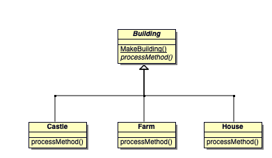

# Design Pattern > Creational > Factory Method

## Check List

1. If you have an inheritance hierarchy that exercises polymorphism, consider adding a polymorphic creation capability by defining a `static` factory method in the base class.
2. Design the arguments to the factory method. What qualities or characteristics are necessary and sufficient to identify the correct derived class to instantiate?
3. Consider designing an internal "object pool" that will allow objects to be reused instead of created from scratch.
4. Consider making all constructors `private` or `protected`.

## Rules

- Abstract Factory classes are often implemented with Factory Methods, but they can be implemented using Prototype.
- Factory Methods are usually called within Template Methods.
- Factory Method: creation through inheritance. Prototype: creation through delegation.
- Often, designs start out using Factory Method (less complicated, more customizable, subclasses proliferate) and evolve toward Abstract Factory, Prototype, or Builder (more flexible, more complex) as the designer discovers where more flexibility is needed.
- Prototype doesn't require subclassing, but it does require an Initialize operation. Factory Method requires subclassing, but doesn't require Initialize.
- The advantage of a Factory Method is that it can return the same instance multiple times, or can return a subclass rather than an object of that exact type.
- Some Factory Method advocates recommend that as a matter of language design (or failing that, as a matter of style) absolutely all constructors should be private or protected. It's no one else's business whether a class manufactures a new object or recycles an old one.
- The `new` operator considered harmful. There is a difference between requesting an object and creating one. The `new` operator always creates an object, and fails to encapsulate object creation. A Factory Method enforces that encapsulation, and allows an object to be requested without inextricable coupling to the act of creation.

## Online Source:

https://sourcemaking.com/design_patterns/factory_method